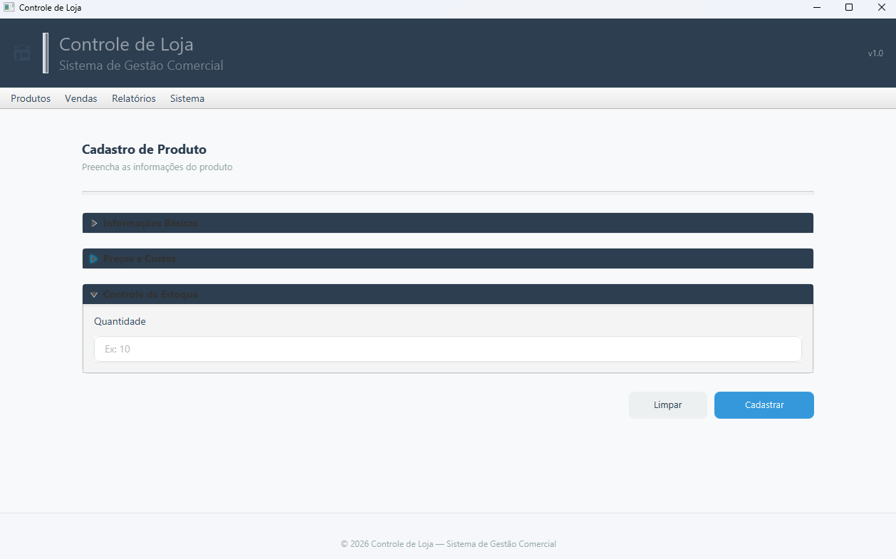
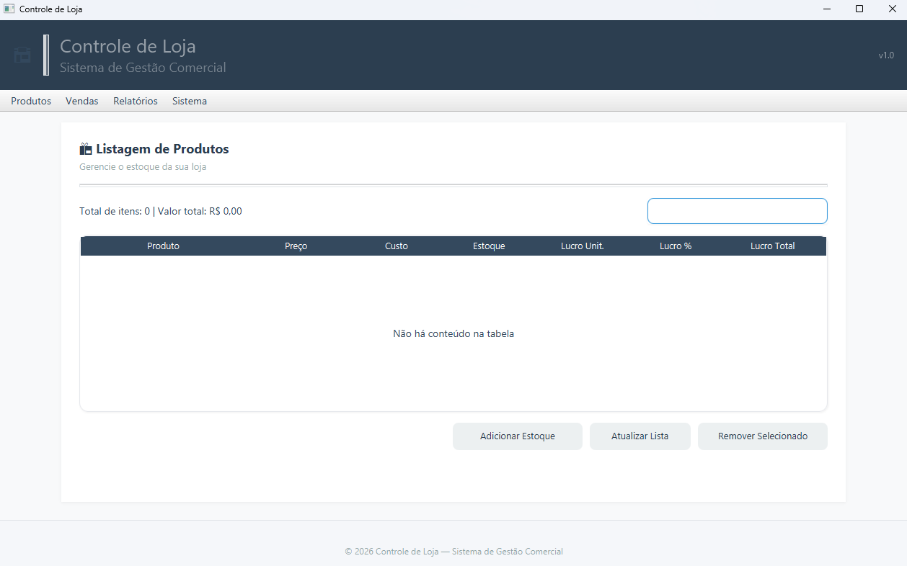
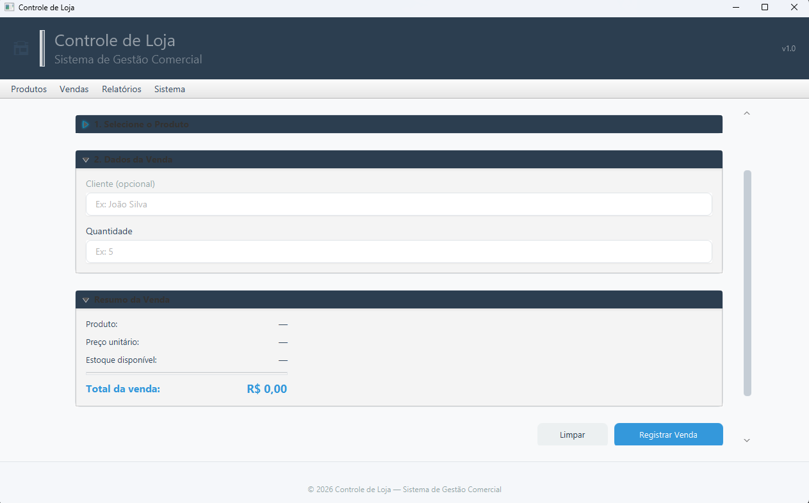
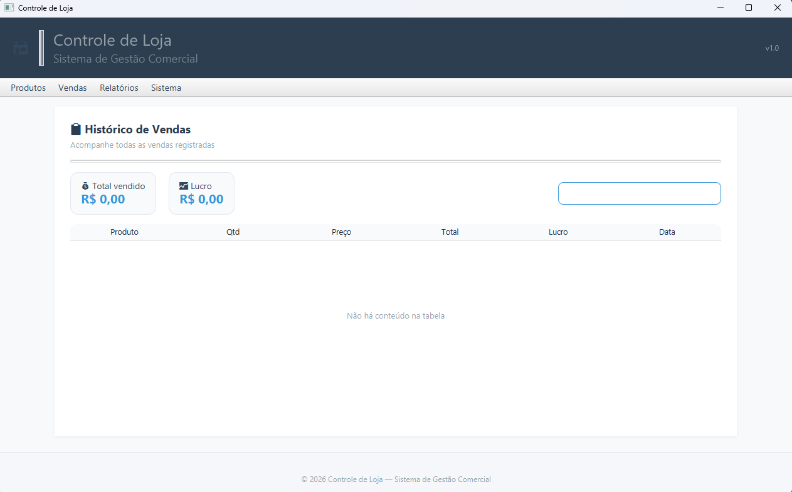
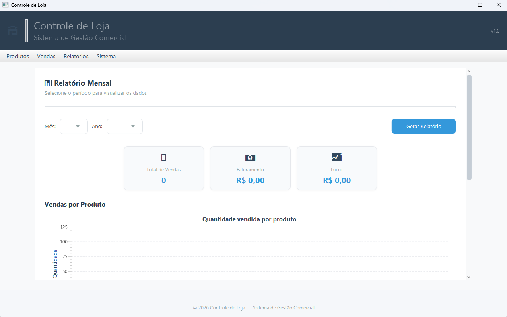
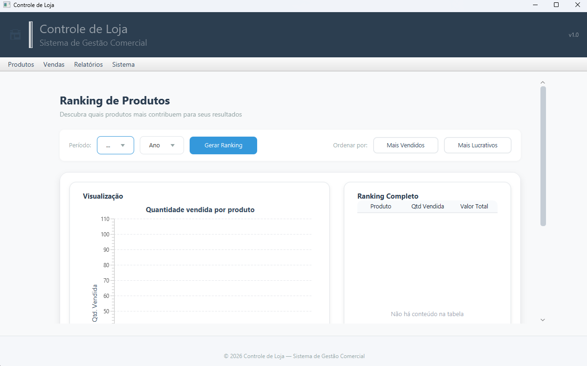

-orange)


# 🏪 Controle de Loja

Sistema desktop para gestão de produtos, vendas e controle financeiro, desenvolvido em **Java + JavaFX** e utilizado em ambiente real (comércio familiar).

---

## 📌 Visão Geral

O sistema foi criado para resolver problemas reais de controle de estoque, vendas e fiado, evoluindo de um projeto simples para uma aplicação com regras de negócio mais robustas, incluindo cálculo correto de lucro com base em custo real.

---

## ⚙️ Funcionalidades

- 📦 Cadastro e listagem de produtos  
- 🛒 Registro de vendas (à vista e fiado)  
- 📊 Dashboard com KPIs (faturamento, lucro, ranking)  
- 🔎 Busca dinâmica e filtros em tempo real  
- 👥 Controle de contas de clientes (fiado)  
- 📈 Relatórios e ranking de produtos  

---

## 🔥 Diferencial Técnico

### 💡 Controle de estoque com FIFO (First In, First Out)

O sistema implementa um modelo de estoque baseado em **lotes com custo individual**, permitindo:

- Controle de múltiplos custos para o mesmo produto  
- Cálculo de **custo real por venda**  
- Consumo de estoque por ordem de entrada (FIFO)  
- Evita distorção no cálculo de lucro  

📌 Exemplo:
> Produto com 2 lotes (R$10 e R$20) → venda consome primeiro o mais antigo, garantindo precisão financeira.

---

## 🧠 Regras de Negócio

- Separação entre:
  - Registro de venda
  - Liquidação financeira (fiado)

- Prevenção de:
  - Duplicidade de vendas  
  - Inconsistência de lucro  

- Cálculo automático de:
  - Lucro unitário  
  - Lucro total  
  - Margem percentual  

---

## 🏗️ Arquitetura

O projeto segue o padrão em camadas:
- **Controller** → Interface (JavaFX)
- **Service** → Regras de negócio
- **Repository** → Persistência (JSON)

---

## 💾 Persistência

- Armazenamento em arquivos `.json` utilizando **Gson**
- Simples, leve e funcional para aplicações desktop

---

## 🛠️ Tecnologias

- Java  
- JavaFX  
- FXML  
- CSS  
- Gson  
- Collections API  
- Streams / Lambdas  
- Git / GitHub  

---

## 📸 Interface do Sistema

### 📝 Cadastro de Produto
<p align="center">
  
</p>

### 📋 Listagem de Produtos
<p align="center">
  
</p>

### 🛒 Tela de Vendas
<p align="center">
  
</p>

### 📋 Histórico de Vendas
<p align="center">
  
</p>

### 🧾 Relatório de Vendas
<p align="center">
  
</p>

### 📊 Ranking de Produtos
<p align="center">
  
</p>

---

## 🚀 Como executar

```bash
# Clone o projeto
git clone https://github.com/SEU-USUARIO/controle-de-loja.git

# Abra no IntelliJ ou IDE de sua preferência
# Execute a classe LojaAppFX
